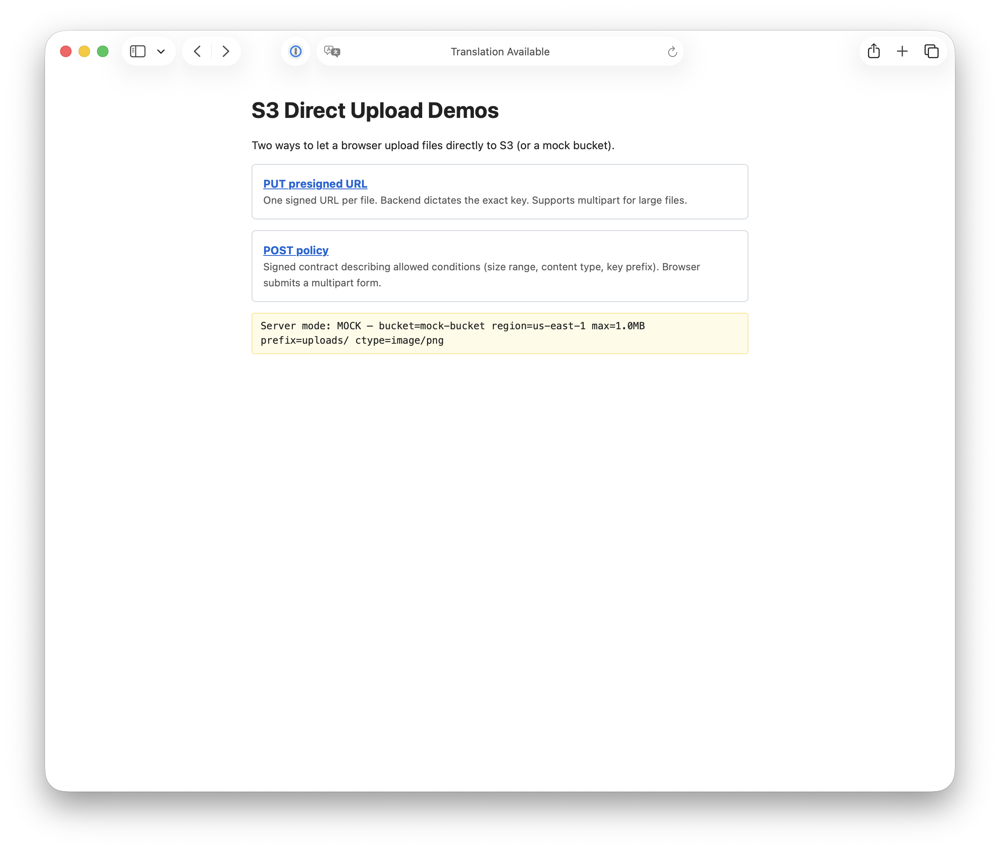
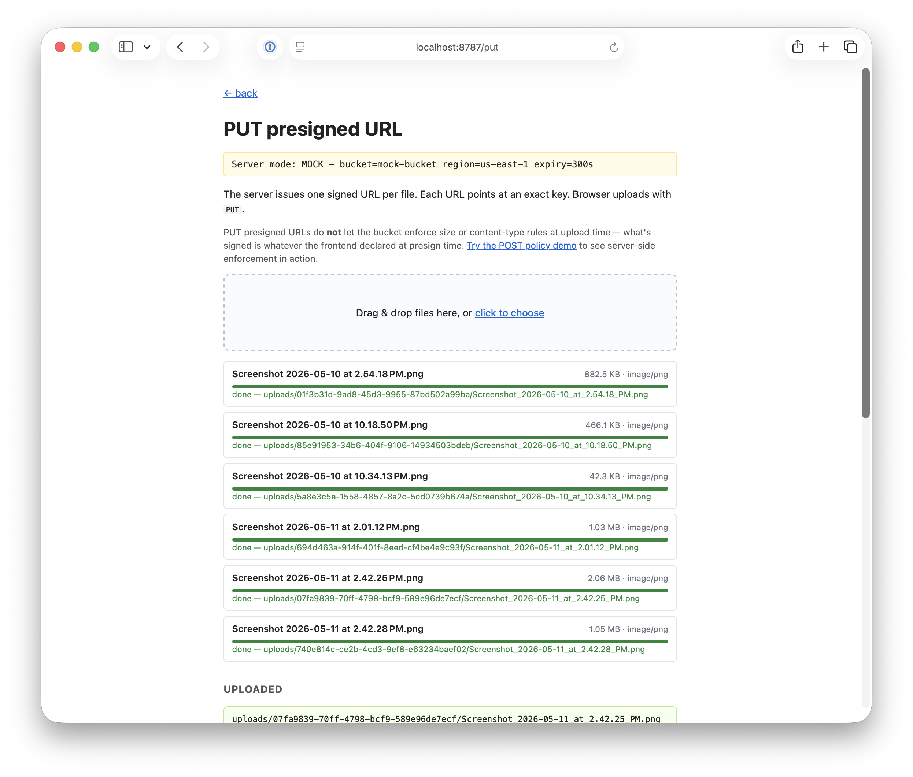
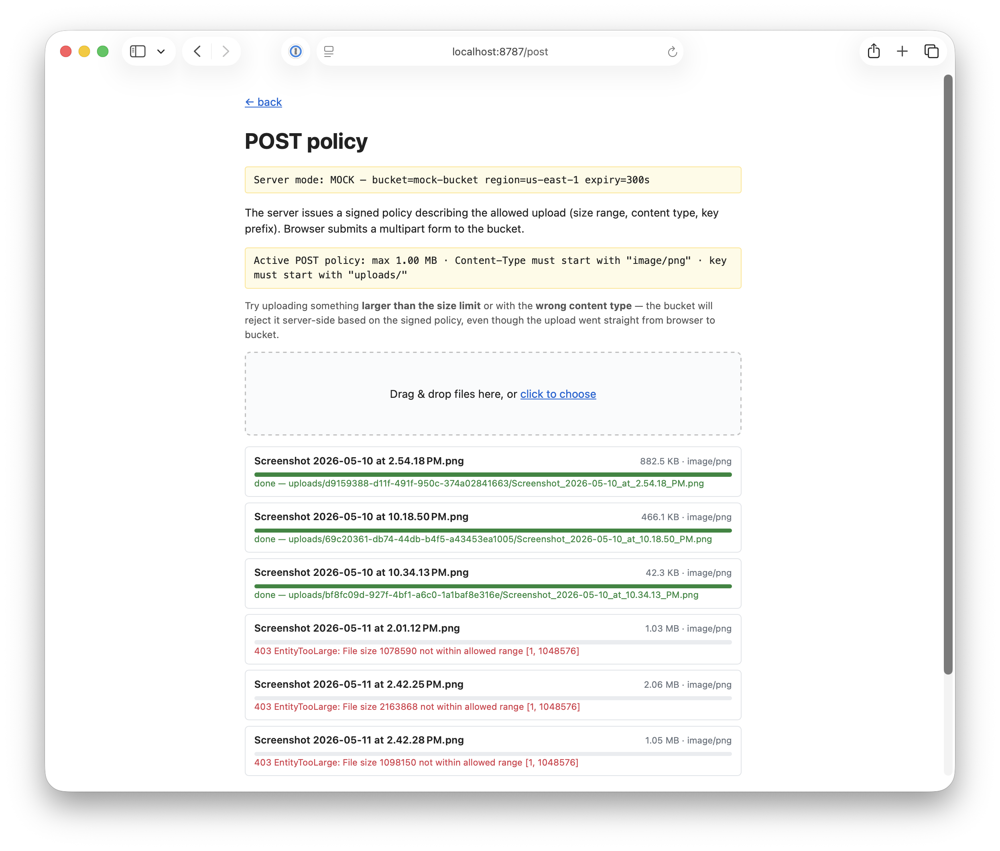

# s3-fileupload

Tiny demo comparing two ways for a browser to upload files directly to S3:

1. **PUT presigned URL** — one signed URL per file, exact key, supports multipart for big files.
2. **POST policy** — a signed contract describing allowed conditions (size range, content type, key prefix), submitted as a multipart form.

Runs in **mock mode** out of the box (no AWS credentials needed). Set the AWS env vars to switch to a real S3 bucket; the frontend code is identical in both modes.

## What it looks like

### 1. Homepage — pick a flow

Mode banner shows the active server config (mock vs real, bucket, region, current size/content-type constraints).



### 2. PUT presigned URL — no server-side constraints

The frontend declares the file's size and content type, the backend signs a URL pinning exactly that, and the upload either matches the signed shape or fails with `SignatureDoesNotMatch`. The **bucket does not enforce a size cap or content-type rule** — whatever the frontend asked for is what gets signed. Every file below succeeded.



### 3. POST policy — bucket enforces size and content type

The backend signs a *policy document* describing what's allowed: max 1 MB and `Content-Type` must start with `image/png`. The frontend submits the file as a multipart form along with the signed policy. **S3 (or the mock standing in for it) reads the policy and rejects violations server-side, without your app code ever seeing the file.** In the screenshot below, three PNGs under 1 MB go through; three over 1 MB get rejected with `403 EntityTooLarge`.



This is the key difference between the two flows:

| | PUT presigned URL | POST policy |
|---|---|---|
| Where the size/type rules live | Signed into one specific request | Signed into a policy document |
| Who enforces them | Nobody server-side — the URL just signs what was asked for | S3 itself, on every upload |
| What you need server-side to reject bad uploads | Application code (your scanner, your event-driven Lambda, etc.) | Nothing — the bucket does it |
| Best for | Single file with known shape, multipart for big files | Letting browsers upload with strict guarantees on size/type |

## Stack

- Node 20+ (uses `import.meta.dirname`)
- TypeScript everywhere: server via `tsx`, browser bundle via `esbuild`
- `@aws-sdk/client-s3`, `@aws-sdk/s3-request-presigner`, `@aws-sdk/s3-presigned-post`
- `busboy` for parsing multipart in mock-S3 endpoint
- No framework — Node `http` + a small router

## Run

```bash
cd s3-fileupload
npm install
npm run start          # one-shot bundle + start server (mock mode)
# OR for hot reload:
npm run dev            # watches client + server
```

Open <http://localhost:8787/>.

### Mock mode (default)

No env vars set. The server issues fake-but-correctly-shaped presigned URLs/policies. Uploads land in `mock_uploads/` on disk and are listed in the UI.

### Real AWS mode

Set the env vars (or copy `.env.example` to `.env`):

```bash
AWS_S3_BUCKET=my-demo-bucket
AWS_REGION=us-east-1
AWS_ACCESS_KEY_ID=...
AWS_SECRET_ACCESS_KEY=...
```

The S3 bucket must have **CORS configured** to allow PUT and POST from your origin. Minimal CORS rule:

```json
[
  {
    "AllowedOrigins": ["http://localhost:8787"],
    "AllowedMethods": ["PUT", "POST", "GET"],
    "AllowedHeaders": ["*"],
    "ExposeHeaders": ["ETag"],
    "MaxAgeSeconds": 3000
  }
]
```

## Config knobs (env vars)

| Var | Default | Meaning |
|---|---|---|
| `PORT` | 8787 | server port |
| `AWS_S3_BUCKET` | (unset → mock) | bucket name; if unset, server runs in mock mode |
| `AWS_REGION` | us-east-1 | AWS region |
| `MAX_UPLOAD_BYTES` | 10485760 | 10 MB — enforced by POST policy `content-length-range` |
| `ALLOWED_CONTENT_TYPE_PREFIX` | (empty) | e.g. `image/` to restrict POST uploads to images |
| `KEY_PREFIX` | uploads/ | every upload gets a key under this prefix |
| `PRESIGN_EXPIRES_IN` | 300 | presigned URL/policy lifetime in seconds |

## What the demos show

- Drag and drop multiple files into either page.
- Per-file progress bar (via `XMLHttpRequest.upload.onprogress` — `fetch()` doesn't surface upload progress).
- A collapsible "what the backend returns" panel shows the raw presign response so you can see the difference between a PUT URL and a POST policy payload.
- An "Uploaded" list (mock mode only) showing files in `mock_uploads/`.

## What's NOT in this demo

- Real signature validation in mock mode (it just accepts whatever).
- Multipart S3 upload for big files (PUT presigned URL covers up to 5 GB single-shot; beyond that you'd switch to CreateMultipartUpload + per-part presigned URLs).
- Virus scan / quarantine→clean bucket promotion (out of scope; the demo is the upload step only).
- Per-user authentication on the presign endpoint (a real deployment must rate-limit the presign endpoint).

## Frontend / backend type contract

Both share `lib/types.ts`. The frontend imports types from the same file the server uses, so any change to the presign response shape is caught at compile time on both sides.

## Layout

```
server.ts             Node http server (routes + mock-S3 endpoint)
lib/
  types.ts            shared FE/BE types
  config.ts           env-var-driven config + mode detection
  presign.ts          real AWS path
  mock-presign.ts     mock path (fake-but-same-shape responses)
client/
  client.ts           drag-drop UI + per-file progress (XHR)
public/
  index.html, put.html, post.html, style.css
  client.js           generated by esbuild from client/client.ts
mock_uploads/         where mock-mode files land (gitignored)
```
